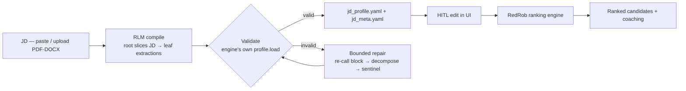
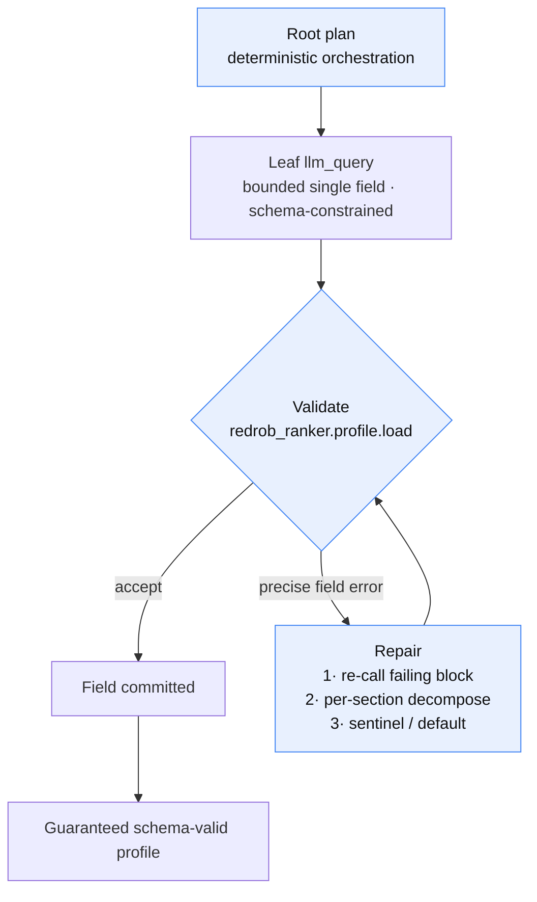
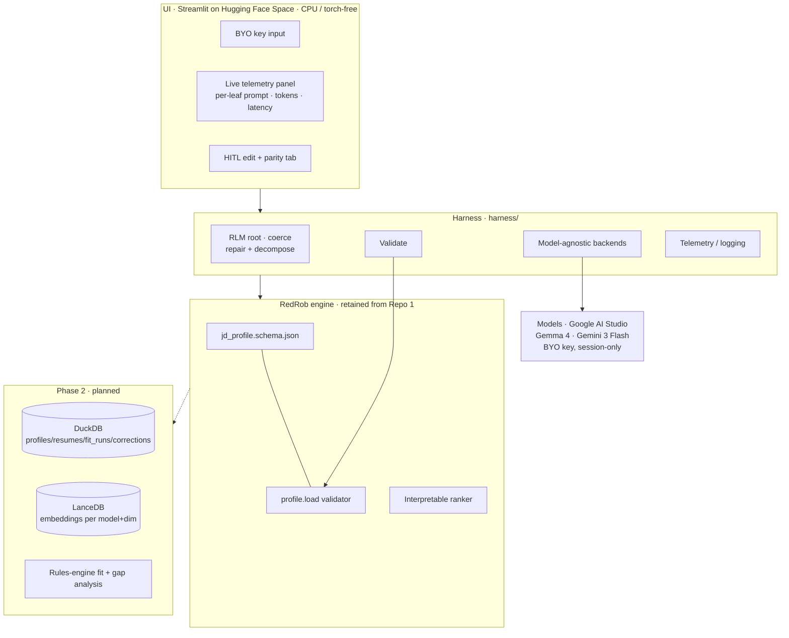
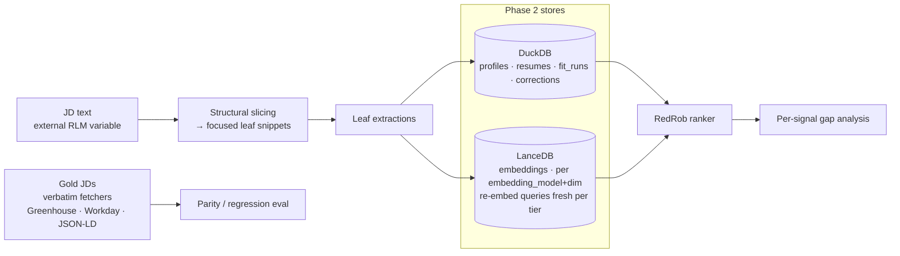
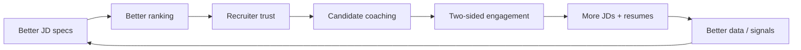

# Submission Deck — Paste-Ready Points

**Track selected: Technical / AI-System track** (Deck 3,
`docs.google.com/presentation/d/1wbyNRn6gNWY_KnmR3_w-FefjK4GM9kuhohOts582ksU`).
Chosen over the Idea/UX track (too shallow for our engineering) and the
Growth/Monetization track (we have no monetization/growth-loop story). This track's
mandatory elements — AI decision flow, system architecture, data/intelligence layer —
are exactly our strengths.

Project: **Resume-Fit — an AI-native JD→profile compiler + candidate fit layer**, built
on the existing **RedRob interpretable ranking engine** (Repo 1).

> Claim rules honored throughout: **no benchmark number is stated as proven** (nothing in
> this repo has been formally benchmarked yet); any improvement is marked
> **estimated/projected**; and every comparison vs direct-LLM ranking points to the
> **Repo 1 README / HF demo homepage** rather than quoting a figure here.

**Confirmed links**
- GitHub: `https://github.com/Ranjit1312/IndiaRuns_AI_resumeRanker`
- HF Space (live demo): `https://huggingface.co/spaces/Ranjit1312/Resume_Ranker`
- Repo 1 (RedRob ranker, reference for comparison numbers): `https://github.com/Ranjit1312/redrob_indiaRuns`

---

## Slide 1 — Redrob Context & Ideathon Scope *(positioning; context text is pre-filled)*
- **We extend Redrob's core hiring capability, we don't rebuild it.** Redrob already
  ranks candidates; we add the missing *front half* (turn any JD into a precise,
  machine-checkable spec) and a *candidate-facing* layer (fit + coaching).
- **New AI-native workflow:** a JD-compiler that produces the exact config the RedRob
  ranker consumes — making ranking reproducible and auditable instead of ad-hoc.
- **Why Redrob is uniquely positioned:** the value only exists because RedRob's
  interpretable ranking engine exists; our harness plugs directly into its own schema and
  validator.

## Slide 2 — Team & Problem Statement
- **Team Name:** `<<TEAM_NAME>>`  *(TO FILL)*
- **Team Members:** `<<TEAM_MEMBERS>>`  *(TO FILL)*
- **Problem Statement:** Job descriptions are unstructured prose, so candidate ranking is
  either keyword/ATS matching (shallow, unexplainable) or a single opaque LLM call
  (unreliable, unauditable). There is no precise, machine-checkable bridge from "JD text"
  to "what the ranking engine should actually score."

---

## Slide 3 — Problem Definition
- **What problem are you solving?** Converting free-form JDs into a *structured, validated
  specification* the ranking engine can score — and giving candidates an explainable fit
  signal — without a black-box model.
- **Who experiences it?** Recruiters (opaque scores they can't defend) and candidates (no
  actionable feedback on *why* they fit or don't).
- **Why is the current approach insufficient?** Keyword/ATS matching misses context and
  role nuance; a single large-LLM call can hallucinate fields, isn't schema-valid, and
  can't be audited. Neither yields a reproducible, engine-ready spec.

## Slide 4 — Opportunity & Vision
- **Why is this an important opportunity?** Every downstream ranking decision is only as
  good as the JD→spec step; getting it right makes the *entire* RedRob ranking pipeline
  more precise, explainable, and trustworthy.
- **Future state we enable:** any JD → a guaranteed schema-valid profile in seconds →
  transparent, per-signal ranking → candidate-facing gap coaching. A closed loop from job
  post to actionable candidate feedback, all interpretable.

## Slide 5 — Solution Overview
- **What is the solution?** **Resume-Fit** — a **model-agnostic harness** that compiles any
  JD (free prose) into a **schema-valid `jd_profile.yaml`** (the config that drives the
  RedRob ranker) plus a coaching sidecar `jd_meta.yaml`. **Module 1 is live** on a
  Streamlit HF Space; **Module 2** (resume→fit + per-signal gap analysis) is in progress.
- **Why AI-native, not AI-assisted?** The LLM is embedded inside a **deterministic control
  loop**, not called once for an answer: a depth-1 **Recursive Language Model (RLM)**
  (arXiv 2512.24601) treats the JD as an external variable, a deterministic root **slices
  it and dispatches focused leaf extractions**, then **validates → self-repairs →
  degrades** structurally. The system *reasons about structure*; the model only fills
  bounded sub-fields.
- **Which Redrob capability it builds upon:** the **RedRob interpretable ranking engine** —
  we reuse its exact JSON-Schema and its own `redrob_ranker.profile.load` validator, so a
  "valid" profile is valid *by the engine's definition*.

---

## Slide 6 — User Journey / Workflow Diagram  *(Mandatory Visual)*
**Bullets:**
- **How a user interacts:** paste a JD (or upload PDF/DOCX) + your own Google AI Studio key
  (session-only) → click Compile → watch each extraction stream live → edit in the
  human-in-the-loop panel → download `jd_profile.yaml` + `jd_meta.yaml`.
- **Information flow:** JD prose → structured profile → validated → handed to the RedRob
  ranker, which scores candidates against it.
- **Where it integrates with Redrob:** the emitted profile *is* the ranker's input config —
  zero glue code.

**Diagram (Mermaid):**

## Slide 7 — AI Logic & Decision Flow  *(Mandatory Visual)*
**Bullets:**
- **Where AI intervenes:** only at the **leaves** — focused, single-sub-field extractions
  (role, signals, domain terms, disqualifier flags, etc.). The orchestration is
  deterministic code, not the model.
- **How decisions are made:** each leaf output is **schema-constrained**, then checked by
  the engine's validator; on failure the root **re-calls only the failing block**, then
  falls back to **per-section decomposition**, then to **sentinel/default degradation** —
  so output is *always* schema-valid, never a hallucinated blob.
- **How models/reasoning interact:** root (deterministic planner) ⇄ leaf `llm_query`
  (bounded extraction) ⇄ authoritative validator (accept / reject with a precise field
  error that seeds the repair). Model-agnostic: Gemma 4 variants or Gemini-3-Flash.

**Diagram (Mermaid):** *(blue = deterministic code; LLM acts only at the leaf)*

## Slide 8 — System Architecture  *(Mandatory Visual)*
**Bullets / components:**
- **UI:** Streamlit app (`app.py`) — BYO-key input, live telemetry panel (per-leaf prompt,
  tokens, elapsed), HITL edit, parity tab. Deployed as a **Hugging Face Space** (CPU basic,
  **torch-free**).
- **Harness (`harness/`):** model-agnostic backends, per-field prompts, `coerce` (root plan:
  repair + decompose), `validate`, `parity` eval, structured telemetry/logging.
- **Schema + validator (`jd/`, `redrob_ranker/profile.py`):** retained from Repo 1 — the
  authoritative JSON-Schema and standalone loader.
- **Models:** Google AI Studio — Gemma 4 (`gemma-4-26b-a4b-it` default, `gemma-4-31b-it`;
  `gemini-3-flash` selectable). **BYO key, session-only, never stored.**
- **Redrob systems leveraged:** the RedRob **interpretable ranking engine** and its schema.
- *(Phase 2):* modular embedded **DuckDB + LanceDB** data layer (swappable to enterprise
  DBs); the rules-engine fit + gap-analysis module.

**Diagram (Mermaid):**

## Slide 9 — Data, Context & Intelligence Layer  *(Mandatory Visual)*
**Bullets:**
- **What data powers it:** the JD text itself (as an external RLM variable) + the engine's
  schema + a **10-JD cross-domain gold set** (Amazon, Anthropic, Databricks, Google,
  NVIDIA, Stripe) fetched **verbatim via structured sources** (Greenhouse API, Workday CXS,
  Amazon JSON, JSON-LD) — never a summarizer, so eval integrity is preserved.
- **How context is retrieved/stored/used:** the root **slices the JD into focused snippets**
  per sub-field (retrieval by structure, not chunking). *(Phase 2:)* **LanceDB** stores
  embeddings for semantic signal matching with a strict discipline — every vector carries
  its `embedding_model` + `dim`, and JD queries are **re-embedded fresh per tier** so
  EmbeddingGemma and Gemini vectors are never mixed; **DuckDB** holds profiles, resumes,
  fit-runs, and HITL correction deltas.
- **How Redrob context improves it:** validation and scoring are grounded in RedRob's own
  schema and signals — the intelligence layer inherits the engine's definitions rather than
  inventing its own.

**Diagram (Mermaid):**

---

## Slide 10 — Scalability & Technical Feasibility
- **How it's implemented:** already implemented and live (Module 1) — Python harness +
  Streamlit on a free HF Space; offline test suite green.
- **How it scales:** **small-model-first** — the RLM design uses many *bounded* leaf calls
  instead of one huge context, keeping per-call cost/latency low; a **per-call 60 s timeout
  + bounded repair** caps worst-case runtime; **torch-free / CPU-basic** footprint; a
  configurable **detail-depth** knob trades richness for speed under free-tier rate caps.
- **Technical challenges (and how handled):** free-tier rate limits → live telemetry +
  timeout + explicit rate-cap surfacing; small models lack native JSON-schema mode → the
  *harness* (not the model) guarantees structure; hallucination → authoritative validation
  + graceful degradation.

## Slide 11 — Redrob Ecosystem Integration  *(Mandatory Visual)*
- **Capabilities leveraged:** the RedRob interpretable ranking engine + its schema and
  validator (reused directly, not re-implemented).
- **New capability introduced:** a **JD→spec compiler** (makes ranking reproducible) and a
  **candidate-facing fit + coaching** layer (Module 2) — turning a recruiter-side ranker
  into a **two-sided** experience.
- **How it strengthens the ecosystem:** better JD specs → better ranking → more trust →
  candidates get actionable coaching → more engagement on both sides (a genuine two-sided
  loop).
- **Opportunities unlocked after implementation:** auto-profiling of every posted JD,
  candidate self-service fit checks, gap-driven upskilling suggestions, and a local/offline
  tier (Ollama + Gemma 4 E4B / EmbeddingGemma) for privacy-sensitive use.

**Diagram (Mermaid — flywheel):**

## Slide 12 — Impact & Success Metrics
- **Measurable outcomes (as tracked in-repo, qualitative):** across **10 hand-authored gold
  JDs** spanning security, TPM, PM, pre-sales/SA, FDE, data-science and backend roles, the
  harness produces **schema-valid output for every input** (multi-model parity eval across
  Gemma 4 variants) — **it never emits an invalid file.**
- **How success is tracked:** schema-validity rate, repair-pass count, per-leaf telemetry
  (tokens/latency), and parity across models — all surfaced in the app.
- **On quantitative comparison:** **no accuracy/performance number is claimed as proven
  here — nothing in this repo has been formally benchmarked yet.** For this-approach vs
  **direct LLM calls for ranking** (and vs other methods), ***actual comparison numbers are
  provided in the Repo 1 README and on the HF demo app's homepage for reference.***
- **Value created:** reproducible, auditable ranking specs; candidate-facing explainability.
- **Estimated impact (projection — not yet benchmarked):** an **estimated ~`<<N>>`×** faster
  and more reliable JD→spec creation vs a single manual / direct-LLM pass, with higher
  downstream ranking precision from a validated spec. **These figures are estimates** —
  see the footnote † for where to check the actual measured metric.

## Slide 13 — Future Roadmap
- **Now → tomorrow (Phase 2):** resume → candidate schema → interpretable **rules-engine
  fit + per-signal gap analysis** + HITL correction; modular **DuckDB + LanceDB** data
  layer.
- **2–3 years:** local/offline tier (Ollama + Gemma 4 E4B / EmbeddingGemma) for
  zero-egress privacy; auto-compile of every Redrob JD; candidate self-service fit &
  upskilling; enterprise DB swap (Postgres/pgvector, Snowflake) via the same modular seam.
- **Broader vision:** a fully interpretable, two-sided hiring-intelligence layer on top of
  Redrob — explainable to recruiters *and* candidates, model-agnostic, and cheap to run.

---

# Placeholders to fill before submitting
- `<<TEAM_NAME>>`, `<<TEAM_MEMBERS>>`
- `<<N>>` in the Slide-12 estimated-impact line — insert your estimate (kept labeled
  **estimated**); the actual measured metric is referenced via footnote † to the HF Space.
- **Mandatory visuals:** Mermaid source for all five (Workflow S6, AI decision-flow loop S7,
  System architecture S8, Data-flow S9, Ecosystem flywheel S11) is embedded above — render at
  [mermaid.live](https://mermaid.live) and paste the image into each slide (the ≤5-slide PDF
  appendix can hold higher-res versions).

---

† **Actual measured metrics.** Quantitative results for this approach vs **direct LLM calls
for ranking** (and vs other methods) are published on the **HF Space homepage**
(`https://huggingface.co/spaces/Ranjit1312/Resume_Ranker`) and in the **Repo 1 README**
(`https://github.com/Ranjit1312/redrob_indiaRuns`). Any figure marked *estimated* in this
deck is a projection pending formal benchmarking — check the HF Space for the real number.

# Notes
- Links above are the ones you confirmed; verify both open **publicly** before submitting.
- **No benchmarked metrics exist in this repo** — all comparison figures are referenced to
  Repo 1 README / HF homepage, never asserted here.
- Module 2 (resume→fit, rules engine, gap analysis, DuckDB/LanceDB) is described as
  **in progress / planned**, not shipped.
